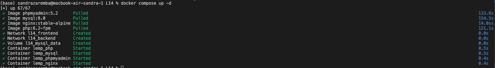
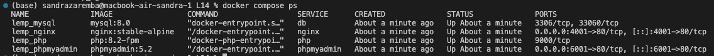
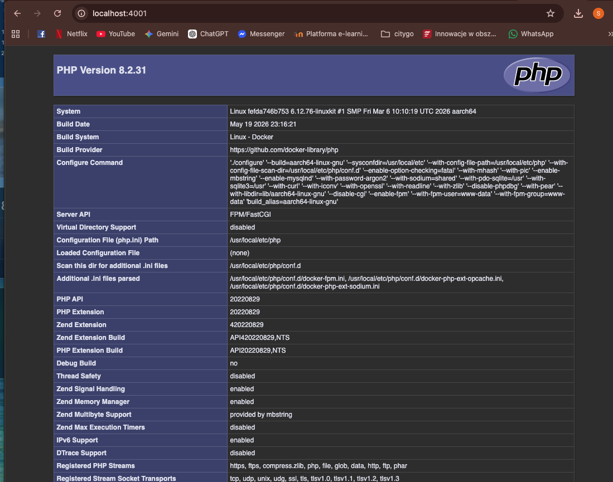
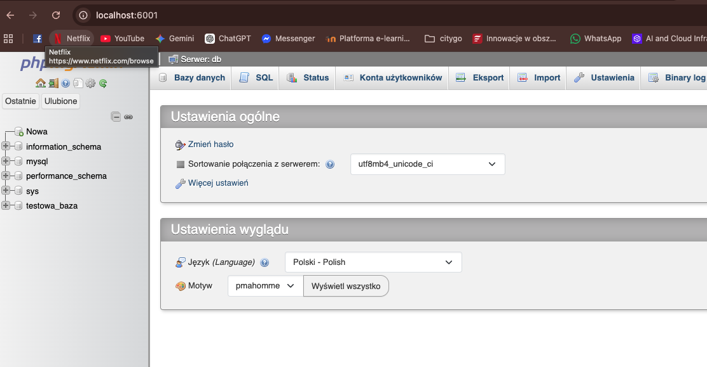
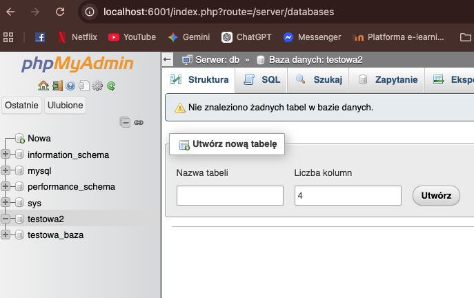

# Laboratorium 14 - Docker Compose 
# Technologie Chmurowe  
# Sandra Zaremba  

---

## 1. Opis Zadania 
Celem zadania było  zaprojektowanie i uruchomienie kompletnego środowiska programistycznego **LEMP (Linux, Nginx, MySQL, PHP)** wraz z webowym panelem zarządzania **phpMyAdmin** za pomocą narzędzia **Docker Compose**. 

---

## 2. Opis zawartości plików i uzasadnienie konfiguracji
**src/index.php**
Prosty skrypt PHP uruchamiający wbudowaną funkcję phpinfo().

**nginx/default.conf**
Plik konfiguracyjny serwera Nginx. 

**docker-compose.yml**
Główny plik definiujący cztery usługi:

* **db (MySQL 8.0):** Przechowuje dane, odizolowany w sieci wewnętrznej backend.

* **php (PHP 8.2-FPM):** Silnik interpretujący kod PHP, podłączony do sieci backend i posiadający zamontowany katalog src.

* **nginx (Nginx Stable-Alpine):** Bramka wejściowa do aplikacji. Mapuje port wewnętrzny 80 na port hosta 4001. Należy do sieci frontend i backend.

* **phpmyadmin (phpMyAdmin 5.2):** Narzędzie administracyjne mapowane na port hosta 6001.

## 3. Przebieg uruchomienia i komendy terminala

**Uruchomienie struktury kontenerów**
`docker compose up -d`

**Weryfikacja uruchomionych usług**
`docker compose ps`

**Dowód działania serwera LEMP pod adresem http://localhost:4001**

**Widok po zalogowaniu się do bazy pod adresem http://localhost:6001**

**Widok po inicjalizacji nowej testowej bazy danych pod adresem http://localhost:6001**

## 4. Wnioski
Dzięki narzędziu Docker Compose i plikowi docker-compose.yml możemy jednym poleceniem uruchomić kompletny zestaw aplikacji złożony z czterech współpracujących usług: lemp_nginx, lemp_php, lemp_mysql oraz lemp_phpmyadmin.

Podział na odizolowane sieci logiczne pozwala bezpiecznie ukryć bazę danych w sieci backend, jednocześnie dając użytkownikowi wygodny dostęp do serwera WWW na porcie 4001 oraz panelu zarządzania na porcie 6001 poprzez sieć frontend.
